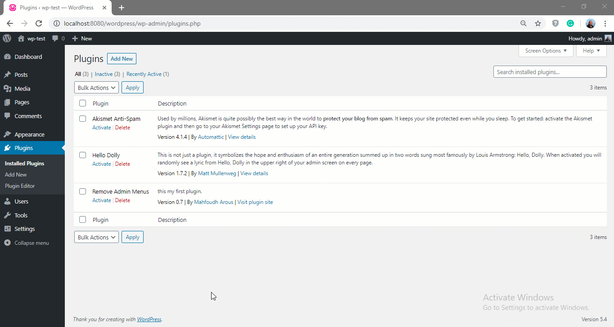

# my-first-wordpress-plugin

Playing around with WordPress plugin development  
this plugin remove some not used admin menu items. 
  

## roadmap

- [x] writhe the plugin template  
- [x] adding the code to remove some admin menu items  
- [x] adding plugin settings page  
- [x] register and save settings  
- [x] read settings  
- [ ] adding more customization options  
